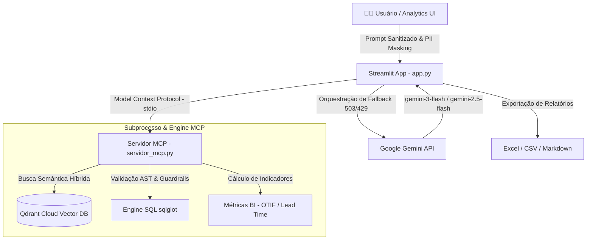

# 🤖 Vetra — Agente Consultivo de Dados & GenAI (Enterprise Platform)

A **Vetra** é uma plataforma consultiva de inteligência de dados desenvolvida para atuar como assistente de Engenharia de Dados e BI. Ela combina arquitetura desacoplada via **Model Context Protocol (MCP)**, busca semântica **RAG no Qdrant Cloud**, validação de segurança **SQL AST (Schema-Aware)** e **resiliência com fallback multi-modelo** usando a Google Gemini API.

---

## 🏛️ Arquitetura do Sistema

---

📝 Changelog
[v1.2.0] — 2026-09-28
Added
Módulo Core de Segurança (core/):

rag_guard.py: Implementado controle de acesso RBAC (Role-Based Access Control) com filtros por departamento e nível de acesso no Qdrant.

Mitigação de Indirect Prompt Injection utilizando envoltórios e tags de contexto estritas (<contexto>).

api_client.py: Wrapper de comunicação com APIs externas centralizado para requisições seguras.

Resiliência e Cache de APIs:

Adicionados timeouts curtos e mecanismos de fallback/cache para serviços públicos de terceiros (IBGE, BrasilAPI, Banco Central, Open-Meteo, OpenStreetMap).

Ajuste de Caminhos e Resolução Dinâmica:

Injeção automática da raiz do projeto (sys.path) no app.py para permitir importações absolutas a partir da pasta core/.

Fixed
Resolução de exceções de importação em ambientes de contêineres e na implantação do Streamlit Cloud (ModuleNotFoundError).

[v1.1.0] — 2026-09-15
Added
Integração MCP (Model Context Protocol): Comunicação entre o Streamlit (app.py) e o servidor de ferramentas (servidor_mcp.py).

Validação de SQL via AST: Checagem de sintaxe e schemas através do sqlglot impedindo instruções destrutivas (DELETE, DROP).

Sanitização de PII: Mascaramento automático via regex para CPFs, e-mails e telefones em logs e uploads.

Visualizações e Exportações: Painel com renderização de gráficos Plotly e suporte a exportação em Excel (.xlsx), CSV e relatórios Markdown.

[v1.0.0] — 2026-08-01
Added
Lançamento inicial da plataforma Vetra com interface Streamlit e orquestração de LLMs da família Google Gemini.

Suporte a busca vetorial simples no Qdrant Cloud.